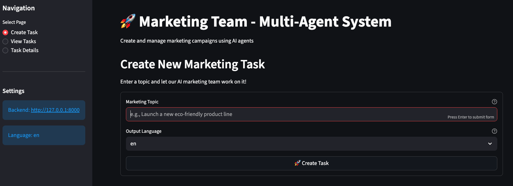

# 🚀 Multi-Agent Marketing Team System

<div align="center">

**An intelligent marketing automation application that creates comprehensive marketing campaigns using CrewAI multi-agent orchestration and OpenAI**

[](https://www.python.org/)
[](https://www.crewai.com/)
[](https://openai.com/)
[](https://fastapi.tiangolo.com/)
[](https://streamlit.io/)

*Perfect for learning CrewAI, multi-agent systems, and intelligent marketing automation*

</div>

---

## 🎯 What is This Project?

This is a **complete multi-agent marketing team system** that demonstrates how to build an intelligent marketing automation application that:

- Automatically creates comprehensive marketing campaigns from a single topic
- Uses multiple AI agents working together via CrewAI orchestration
- Generates marketing strategies, content, social media posts, and campaign plans
- Provides actionable marketing insights and deliverables
- Offers both REST API and interactive web interface

**Perfect for students learning:**

- 🤖 CrewAI multi-agent orchestration
- 🧠 Agent collaboration and task delegation
- 💬 LLM prompt engineering and structured outputs
- 🚀 Building production-ready AI applications
- 📊 Full-stack development with FastAPI and Streamlit

---

## ✨ Key Features

| Feature | Description |
|---------|-------------|
| 🤖 **Multi-Agent System** | Four specialized agents: Strategist, Content Creator, Social Media Specialist, and Campaign Manager |
| 📝 **Comprehensive Campaigns** | Generates complete marketing strategies, content plans, and social media posts |
| 📊 **Interactive Dashboard** | Beautiful Streamlit UI with task management and real-time status updates |
| 🔄 **Task Tracking** | Monitor marketing tasks from creation to completion |
| 📈 **Real-time Status** | Track task progress (pending, in_progress, completed, failed) |
| 💾 **Embedded Database** | SQLite database for persistent task storage |
| 🌍 **Multi-language Support** | Generate marketing content in multiple languages (en, es, fr, de, it, pt) |
| ⚡ **REST API** | Full-featured FastAPI backend with OpenAPI documentation |
| 🎨 **Rich Outputs** | Get marketing strategies, blog outlines, social posts, and campaign ideas |
| 🚀 **Production Ready** | Async/await, type hints, error handling, and best practices |

---

## 🏗️ Architecture Overview

```
┌─────────────────┐
│   User Input    │  "Launch a new eco-friendly product line"
└────────┬────────┘
         │
         ▼
┌─────────────────────────────────────┐
│      CrewAI Multi-Agent System      │
│                                     │
│  ┌───────────────────────────────┐  │
│  │  1. Marketing Strategist      │  │
│  │     - Market analysis         │  │
│  │     - Target audience         │  │
│  │     - Competitive positioning │  │
│  │     - Channel recommendations │  │
│  └──────────────┬────────────────┘  │
│                 │                    │
│  ┌──────────────▼────────────────┐  │
│  │  2. Content Creator           │  │
│  │     - Blog post outlines      │  │
│  │     - Key messaging points    │  │
│  │     - Content themes          │  │
│  └──────────────┬────────────────┘  │
│                 │                    │
│  ┌──────────────▼────────────────┐  │
│  │  3. Social Media Specialist   │  │
│  │     - Platform-specific posts │  │
│  │     - Instagram, Twitter,     │  │
│  │       LinkedIn content        │  │
│  └──────────────┬────────────────┘  │
│                 │                    │
│  ┌──────────────▼────────────────┐  │
│  │  4. Campaign Manager          │  │
│  │     - Timeline & milestones   │  │
│  │     - Success metrics         │  │
│  │     - Implementation steps    │  │
│  └──────────────┬────────────────┘  │
└─────────────────┼────────────────────┘
                  │
                  ▼
         ┌────────────────┐
         │  Marketing     │
         │  Deliverables  │
         │  + Strategy    │
         └────────────────┘
                  │
                  ▼
         ┌────────────────┐
         │  SQLite DB     │
         │  (Persistent)  │
         └────────────────┘
```

---

## 🛠️ Tech Stack

<div align="center">

| Category | Technology | Purpose |
|----------|-----------|---------|
| **🤖 AI/ML** | CrewAI | Multi-agent orchestration and task delegation |
| | LangChain | LLM framework and abstractions |
| | OpenAI GPT-4o-mini | LLM for marketing strategy and content generation |
| **🌐 Backend** | FastAPI | REST API server with async support |
| **💻 Frontend** | Streamlit | Interactive web interface |
| **💾 Database** | SQLAlchemy | ORM for database operations |
| | SQLite | Embedded database for task storage |
| **📦 Data** | Pydantic | Type-safe models and validation |
| **⚙️ Tools** | uv | Fast Python package manager |
| | Python 3.10+ | Programming language |

</div>

---

## 📦 Project Structure

```
crewai-marketing-team/
├── src/
│   ├── __init__.py
│   │
│   ├── shared/                    # 🔧 Shared modules
│   │   ├── __init__.py
│   │   ├── config.py              # ⚙️ Configuration & environment variables
│   │   ├── models.py              # 📊 Pydantic request/response models
│   │   └── database.py            # 💾 Database setup and session management
│   │
│   ├── backend/                   # 🚀 FastAPI backend
│   │   ├── __init__.py
│   │   ├── main.py                # 🚀 FastAPI app & endpoints
│   │   ├── db_models.py           # 💾 Database models
│   │   └── services/              # 🔧 Business logic
│   │       ├── __init__.py
│   │       ├── marketing_crew.py  # 🤖 CrewAI multi-agent system
│   │       └── task_service.py    # 📋 Task management service
│   │
│   └── frontend/                  # 🎨 Streamlit frontend
│       ├── __init__.py
│       └── streamlit_app.py       # 🎨 Streamlit web interface
│
├── pyproject.toml                 # 📋 Dependencies & project config
├── .env.example                   # 🔐 Environment variables template
├── .gitignore
├── LICENSE
└── README.md
```

---

## 🚀 Quick Start

### Prerequisites

- **Python 3.10+** installed
- **OpenAI API Key** ([Get one here](https://platform.openai.com/api-keys))

### Installation Steps

#### 1️⃣ Install uv (if needed)

```bash
curl -LsSf https://astral.sh/uv/install.sh | sh
```

#### 2️⃣ Clone and Navigate

```bash
git clone <repository-url>
cd crewai-marketing-team
```

#### 3️⃣ Install Dependencies

```bash
uv sync
```

This will create a virtual environment and install all required packages.

#### 4️⃣ Configure Environment

Create a `.env` file in the root directory:

```bash
# Required
OPENAI_API_KEY=sk-your-api-key-here

# Optional - Application language
APP_LANGUAGE=en

# Optional - Backend configuration
BACKEND_HOST=127.0.0.1
BACKEND_PORT=8000

# Optional - Database configuration
DATABASE_URL=sqlite+aiosqlite:///./marketing_team.db
```

> 💡 **Tip**: Never commit your `.env` file! It's already in `.gitignore`

---

## 🎮 Usage

### 1️⃣ Start the Backend (FastAPI)

First, start the FastAPI server:

```bash
uv run uvicorn src.backend.main:app --reload --host 127.0.0.1 --port 8000
```

The API will be available at **http://127.0.0.1:8000**

> 💡 **Note**: Keep this terminal running. The Streamlit frontend needs the backend to be running.

### 2️⃣ Start the Frontend (Streamlit)

In a new terminal, launch the interactive web interface:

```bash
uv run streamlit run src/frontend/streamlit_app.py
```

Then open your browser to **http://localhost:8501**

**Features:**

- 🚀 Create new marketing tasks with automatic campaign generation
- 📊 Visual task management with real-time status updates
- 🔄 View task details and marketing deliverables
- 📈 Track all your marketing campaigns
- 🌍 Multi-language content generation
- 📝 View comprehensive marketing strategies, content, and social posts

### 3️⃣ Using the REST API Directly (Optional)

If you prefer to use the API directly without the web interface, you can interact with the endpoints:

**Interactive API Docs:** Visit **http://127.0.0.1:8000/docs** for Swagger UI

#### API Endpoints

| Method | Endpoint | Description |
|--------|----------|-------------|
| `GET` | `/` | API information |
| `GET` | `/health` | Health check |
| `POST` | `/tasks` | Create a new marketing task |
| `GET` | `/tasks` | Get all tasks |
| `GET` | `/tasks/{task_id}` | Get a specific task with results |

#### Example API Request

```bash
curl -X POST "http://127.0.0.1:8000/tasks" \
  -H "Content-Type: application/json" \
  -d '{
    "topic": "Launch a new eco-friendly product line",
    "language": "en"
  }'
```

**Response:**

```json
{
  "task_id": "550e8400-e29b-41d4-a716-446655440000",
  "topic": "Launch a new eco-friendly product line",
  "status": "pending",
  "created_at": "2025-01-15T10:30:00"
}
```

**Get Task Results:**

```bash
curl "http://127.0.0.1:8000/tasks/550e8400-e29b-41d4-a716-446655440000"
```

**Response:**

```json
{
  "task_id": "550e8400-e29b-41d4-a716-446655440000",
  "topic": "Launch a new eco-friendly product line",
  "status": "completed",
  "created_at": "2025-01-15T10:30:00",
  "completed_at": "2025-01-15T10:35:00",
  "content_strategy": "Comprehensive marketing strategy...",
  "social_media_posts": [
    "Instagram post: 🌱 Introducing our new eco-friendly line...",
    "Twitter post: Excited to announce our sustainable product launch..."
  ],
  "blog_outline": "1. Introduction to eco-friendly products...",
  "campaign_ideas": [
    "Earth Day launch campaign",
    "Influencer partnership program"
  ]
}
```

---

## 💡 Example Use Cases

Try these examples to see the marketing team in action:

### Product Launches

- `"Launch a new eco-friendly product line"`
- `"Introduce our premium subscription service"`
- `"Announce the release of our mobile app"`

### Brand Campaigns

- `"Rebrand our company with a modern, tech-forward image"`
- `"Create a campaign to increase brand awareness in the Gen Z market"`
- `"Develop a marketing strategy for entering the European market"`

### Event Marketing

- `"Promote our annual tech conference"`
- `"Market our upcoming webinar series on AI"`
- `"Create buzz for our product demo day"`

### Content Marketing

- `"Develop a content strategy for our SaaS platform"`
- `"Create a blog content plan for Q1 2025"`
- `"Design a social media campaign for our new feature release"`

### Seasonal Campaigns

- `"Create a holiday marketing campaign for our e-commerce store"`
- `"Develop a back-to-school promotion strategy"`
- `"Plan a summer sale campaign"`

---

## 🧠 How Multi-Agent Marketing Works

### Step-by-Step Process

1. **User Input** → Marketing topic

   ```
   Topic: "Launch a new eco-friendly product line"
   Language: "en"
   ```

2. **Marketing Strategist Agent** → Develops comprehensive strategy

   ```
   - Target audience analysis
   - Market positioning
   - Competitive landscape
   - Recommended marketing channels
   - Key messaging framework
   ```

3. **Content Creator Agent** → Creates content plan

   ```
   - Blog post outline
   - Key messaging points
   - Content themes and topics
   - Content calendar suggestions
   ```

4. **Social Media Specialist Agent** → Generates social content

   ```
   - Instagram posts (visual-focused)
   - Twitter/X posts (concise, engaging)
   - LinkedIn posts (professional, B2B)
   - Platform-specific optimizations
   ```

5. **Campaign Manager Agent** → Coordinates campaign plan

   ```
   - Timeline and milestones
   - Success metrics (KPIs)
   - Implementation steps
   - Resource requirements
   - Risk assessment
   ```

6. **Storage** → Saves to database

   ```
   Task stored with:
   - Complete marketing strategy
   - Content plan
   - Social media posts
   - Campaign timeline
   - All deliverables
   ```

### Key Components

- **`src/backend/services/marketing_crew.py`**: Core CrewAI implementation
  - Four specialized agents (Strategist, Content Creator, Social Media Specialist, Campaign Manager)
  - Sequential task execution
  - Task delegation and collaboration
  - Structured output generation

- **`src/backend/main.py`**: FastAPI endpoints
  - Task creation and management
  - Background task execution
  - Error handling and status tracking

- **`src/backend/db_models.py`**: Data models
  - SQLAlchemy models for task storage
  - Task status tracking
  - Result persistence

- **`src/shared/models.py`**: Pydantic models
  - Type-safe request/response models
  - Validation rules
  - Task status enums

- **`src/frontend/streamlit_app.py`**: Web interface
  - Task creation form
  - Real-time status updates
  - Results visualization
  - Task management dashboard

---

## 📊 Marketing Deliverables

Each marketing task generates comprehensive deliverables:

| Deliverable | Description | Example |
|-------------|-------------|---------|
| 📋 **Marketing Strategy** | Complete strategy document with audience analysis, positioning, and channel recommendations | Target audience: Eco-conscious millennials, Positioning: Premium sustainable products |
| 📝 **Content Strategy** | Blog outlines, messaging points, and content themes | Blog outline: 1. Introduction, 2. Product benefits, 3. Sustainability impact |
| 📱 **Social Media Posts** | Platform-optimized posts for Instagram, Twitter, LinkedIn | Instagram: Visual post with eco-friendly imagery, Twitter: Engaging thread about sustainability |
| 💡 **Campaign Ideas** | Creative campaign concepts and initiatives | Earth Day launch, Influencer partnerships, Sustainability challenge |
| 📅 **Campaign Plan** | Timeline, milestones, metrics, and implementation steps | Week 1: Pre-launch, Week 2: Launch, Week 3-4: Sustained promotion |

---

## 🎓 Learning Objectives

By exploring this project, you'll learn:

✅ **CrewAI Multi-Agent Systems**

- Building crews with specialized agents
- Agent roles, goals, and backstories
- Task delegation and collaboration
- Sequential and hierarchical process flows

✅ **Marketing Automation**

- Automated campaign generation
- Content strategy development
- Social media content creation
- Campaign planning and coordination

✅ **Full-Stack AI Applications**

- Building REST APIs for AI services
- Creating interactive UIs with Streamlit
- Database integration with SQLAlchemy
- Async/await patterns and background tasks

✅ **Best Practices**

- Modular code organization
- Environment configuration
- Error handling and validation
- Type hints and static checking
- API documentation

✅ **Production Patterns**

- Multi-agent orchestration
- Structured outputs with Pydantic
- Database persistence
- Frontend-backend separation
- Background task processing

---

## 🔧 Development

### Running Tests

```bash
uv run pytest
```

### Code Formatting

```bash
uv run black src/
uv run ruff check src/
```

### Project Scripts

```bash
# Run Streamlit app
uv run streamlit run src/frontend/streamlit_app.py

# Run FastAPI server
uv run uvicorn src.backend.main:app --reload --host 127.0.0.1 --port 8000
```

---

## 🤔 Common Questions

**Q: Why CrewAI instead of simple LLM calls?**  

A: CrewAI enables multi-agent collaboration, task delegation, and specialized agent roles. Perfect for complex workflows where different expertise is needed.

**Q: Can I customize the agents?**  

A: Yes! Modify the agent definitions in `src/backend/services/marketing_crew.py` to change roles, goals, backstories, or add new agents.

**Q: How long does it take to generate a campaign?**  

A: Typically 2-5 minutes depending on the complexity. The system processes tasks in the background, so you can continue using the app.

**Q: Can I use a different LLM?**  

A: Yes! CrewAI supports many providers. Change the LLM initialization in `src/backend/services/marketing_crew.py`.

**Q: Is this production-ready?**  

A: This is a learning project. For production, add authentication, rate limiting, logging, monitoring, caching, and more robust error handling.

**Q: How does the multi-agent system work?**  

A: Four agents work sequentially: Strategist creates the plan, Content Creator develops content, Social Media Specialist creates posts, and Campaign Manager coordinates everything. CrewAI orchestrates the flow.

**Q: Can I add more agents?**  

A: Absolutely! CrewAI makes it easy to add new agents. Just define them in `marketing_crew.py` and add corresponding tasks.

**Q: What languages are supported?**  

A: The system supports multiple languages (en, es, fr, de, it, pt). Set the `language` parameter when creating a task or configure `APP_LANGUAGE` in `.env`.

---

## 📚 Additional Resources

- [CrewAI Documentation](https://docs.crewai.com/)
- [LangChain Documentation](https://python.langchain.com/)
- [FastAPI Documentation](https://fastapi.tiangolo.com/)
- [Streamlit Documentation](https://docs.streamlit.io/)
- [OpenAI API Reference](https://platform.openai.com/docs/)
- [SQLAlchemy Documentation](https://docs.sqlalchemy.org/)
- [Pydantic Documentation](https://docs.pydantic.dev/)

---

## 📝 License

MIT License - see [LICENSE](LICENSE) file for details

---

## 🙏 Acknowledgments

Built with ❤️ for students learning AI, CrewAI, and multi-agent systems.

**Happy Learning! 🚀**

---

<div align="center">

**Made with** ❤️ **for the AI learning community**

⭐ **Star this repo if you found it helpful!**

</div>
